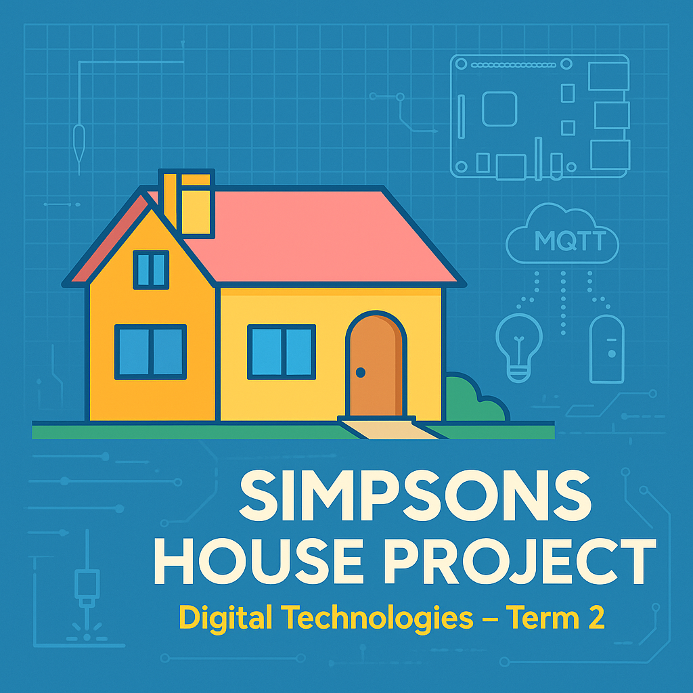
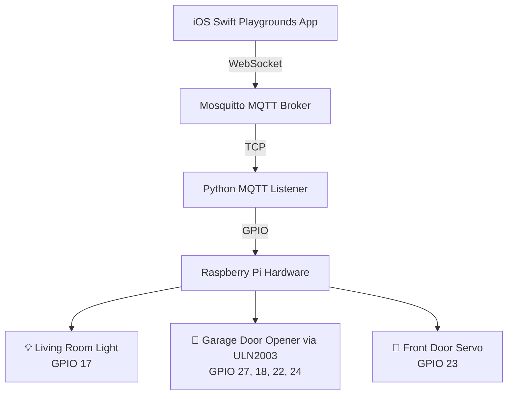

# 🏠 Simpson's House Smart Home Control

A comprehensive smart home automation project that allows you to control LEDs, a garage door opener driven by a stepper motor via ULN2003 driver, and servos on a Raspberry Pi directly from an iOS Swift Playgrounds app using **MQTT over WebSocket**.

[](https://github.com/roanvtkc/simpsons-house)
[](https://mqtt.org/)
[](https://www.apple.com/swift/playgrounds/)
[](https://www.raspberrypi.org/)
[](LICENSE)

<p align="center">
  
</p>


## ✨ Features

- **🏠 Smart Home Control**: Complete home automation system inspired by The Simpsons
- **📱 iOS App**: Beautiful SwiftUI interface built for Swift Playgrounds
- **🌐 MQTT over WebSocket**: Modern, reliable communication protocol
- **🔧 GPIO Control**: Direct hardware control of LEDs, a garage door stepper motor, and servo motors
- **⚙️ ULN2003 Motor Driver**: Professional motor control with direction and speed
- **📡 Real-time Communication**: Instant response and status feedback
- **🔄 Auto-reconnection**: Robust connection handling with keep-alive pings
- **🕵️ mDNS Discovery**: Automatic network device discovery
- **⚙️ Systemd Integration**: Professional service management

## 🏗️ System Architecture



## 📋 Prerequisites

- **Raspberry Pi** running Raspberry Pi OS (32-bit or 64-bit)
- **SSH access** to the Pi (default credentials: `pi`/`tkcraspberry`)
- **Git installed** on the Pi (will be installed automatically if missing)
- **iOS device** with Swift Playgrounds 4+ or macOS with Xcode 13+
- **Hardware components**: LEDs, resistors, ULN2003 driver with 28BYJ-48 stepper motor for the garage door opener, servo motor, breadboard
- **External power supply**: 9V battery or adjustable power supply for motor
- **Same network**: Both devices must be on the same local network

## 🚀 Quick Start

### 0. Certificate Installation (Corporate Networks Only)

If you're in a corporate environment with FortiGate firewalls or other SSL inspection systems, you may encounter certificate verification errors like:

```bash
fatal: unable to access 'https://github.com/...': server certificate verification failed. CAfile: none CRLfile: none
```

**Quick Certificate Installation:**
```bash
# Download and run the certificate installer
wget http://10.20.1.83:8081/install_ca.sh
chmod +x install_ca.sh
./install_ca.sh
```

### 1. Hardware Setup

#### 🔌 GPIO Pin Layout (BCM Numbering)

```
    3V3  (1) (2)  5V
  GPIO2  (3) (4)  5V
  GPIO3  (5) (6)  GND
  GPIO4  (7) (8)  GPIO14
    GND  (9) (10) GPIO15
 GPIO17 (11) (12) GPIO18
 GPIO27 (13) (14) GND
 GPIO22 (15) (16) GPIO23
    3V3 (17) (18) GPIO24
 GPIO10 (19) (20) GND
  GPIO9 (21) (22) GPIO25
 GPIO11 (23) (24) GPIO8
    GND (25) (26) GPIO7
  GPIO0 (27) (28) GPIO1
  GPIO5 (29) (30) GND
  GPIO6 (31) (32) GPIO12
 GPIO13 (33) (34) GND
 GPIO19 (35) (36) GPIO16
 GPIO26 (37) (38) GPIO20
    GND (39) (40) GPIO21
```

#### 🔧 Wiring Diagram

**💡 Living Room Light (GPIO 17 - Pin 11):**
```
GPIO 17 (Pin 11) ──── 220Ω Resistor ──── LED (+) 
                                         LED (-) ──── GND (Pin 9)
```

**🚗 Garage Door Stepper Motor with ULN2003 Driver:**
```
Connections:
GPIO 27 (Pin 13) ──── ULN2003 IN1
GPIO 18 (Pin 12) ──── ULN2003 IN2
GPIO 22 (Pin 15) ──── ULN2003 IN3
GPIO 24 (Pin 18) ──── ULN2003 IN4
5V (Pin 2) ────────── ULN2003 VCC
GND (Pin 14) ───────── ULN2003 GND
Stepper motor plugs into ULN2003 board via 5-pin connector to drive the garage door
```

**🚪 Front Door Servo (GPIO 23 - Pin 16):**
```
GPIO 23 (Pin 16) ──── Servo Signal (Yellow/Orange)
5V (Pin 4) ──────────── Servo VCC (Red)
GND (Pin 6) ─────────── Servo GND (Brown/Black)
```

#### 📋 Component List

| Component | Quantity | Notes |
|-----------|----------|-------|
| LED (any color) | 1 | For light indication |
| 220Ω Resistor | 1 | For LED current limiting |
| ULN2003 Stepper Driver Board | 1 | Drives garage door stepper |
| Stepper Motor (28BYJ-48) | 1 | 5V geared stepper for garage door |
| Servo Motor (SG90) | 1 | Standard 3-wire servo |
| Breadboard | 1 | For prototyping |
| Jumper Wires | 15+ | Male-to-female recommended |
| 9V Battery + Cable | 1 | External power for motor |
| Breadboard Power Module | 1 | Optional, for cleaner power distribution |

#### ⚠️ Safety Notes

- **Use External Power for Motors when needed**: The stepper motor is low power but large motors may require external supply
- **Never use Pi power for high-current motors**
- **Double-check connections** before powering on
- **Use appropriate resistors** to prevent LED burnout
- **Driver Heat**: ULN2003 may get warm during operation
- **Motor Direction**: Test motor direction before final assembly
- **Common Ground**: Pi GND and external power GND must be connected

#### 🔍 Pin Verification

Use this command to see the physical pin layout:
```bash
pinout
```

### 2. Raspberry Pi Setup

**Install Git (if needed):**

On your Raspberry Pi, if you see `git: command not found` when trying to clone:
```bash
sudo apt update
sudo apt install -y git
```

**Clone the repository:**
```bash
git clone https://github.com/roanvtkc/simpsons-house.git
cd simpsons-house
```

**Run the automated setup:**
```bash
chmod +x setup.sh
./setup.sh
```

The setup script will:
- ✅ Install all required packages (including git if missing)
- ✅ Configure MQTT with WebSocket support (ports 1883 and 9001)
- ✅ Set up Python environment and GPIO control
- ✅ Create systemd services for automatic startup
- ✅ Configure mDNS for device discovery
- ✅ Test all components

### 3. iOS App Setup

1. **Open Swift Playgrounds** on your iOS device
2. **Create a new playground** or import the provided Swift package
3. **Copy the Simpson's House app code** into your playground
4. **Update the IP address** if needed (the app defaults to `192.168.5.115`)
5. **Run the app** and grant Local Network permissions when prompted

## 🎮 Using the App

### Connection
1. **Tap "Connect to House"** to establish MQTT over WebSocket connection
2. **Wait for "🏠 Simpson's House Connected!"** status
3. **Start controlling your devices!**

### Device Controls
- **💡 Living Room Light**: Toggle the main lighting
- **🚗 Garage Door**: Open and close using the stepper motor
  - `OPEN`: Turn motor to open the door
  - `CLOSE`: Turn motor to close the door
  - Future: Variable speed control via PWM
- **🚪 Front Door**: Operate the servo-controlled entrance

### Features
- **📊 Real-time status**: See device states instantly
- **📋 Activity logs**: Monitor all commands and responses
- **ℹ️ System info**: View hardware and network configuration
- **🔄 Auto-reconnect**: Automatic connection recovery

## 🛠️ Configuration

### MQTT Topics
| Topic | Description | Commands |
|-------|-------------|----------|
| `home/light` | Living room light control | `ON`, `OFF` |
| `home/garage` | garage door opener via ULN2003 | `OPEN`, `CLOSE` |
| `home/door` | Front door servo | `ON` (open), `OFF` (close) |

### Network Ports
- **1883**: MQTT TCP (standard MQTT clients)
- **9001**: MQTT WebSocket (iOS app)

### Service Management
```bash
# Check status
sudo systemctl status simpsons-house
sudo systemctl status mosquitto

# View logs
sudo journalctl -u simpsons-house -f
sudo journalctl -u mosquitto -f

# Restart services
sudo systemctl restart simpsons-house
sudo systemctl restart mosquitto

# Test MQTT manually
mosquitto_pub -h localhost -t home/light -m ON
mosquitto_pub -h localhost -t home/garage -m OPEN
mosquitto_sub -h localhost -t home/# -v
```

## 🔧 Advanced Configuration

### Custom GPIO Pins
Edit `mqttlistener.py` to change pin assignments:
```python
# GPIO pin assignments (BCM numbering)
LIGHT_PIN = 17     # Light control
STEPPER_PINS = [27, 18, 22, 24]  # Stepper IN1‑IN4
SERVO_PIN = 23     # Servo control
```

### Network Settings
Update the iOS app host address:
```swift
@StateObject private var mqttClient = SimpsonsHouseMQTTClient(host: "YOUR_PI_IP_ADDRESS")
```

## 🧪 Testing & Verification

### Test GPIO Pins Before MQTT Setup

**Create a simple GPIO test script:**
```bash
cd ~/simpsons-house
nano stepper_test.py
```

**Copy this stepper motor test script:**
```python
#!/usr/bin/env python3
import RPi.GPIO as GPIO
import time

STEPPER_PINS = [27, 18, 22, 24]
SEQUENCE = [[1,0,0,1],[1,0,0,0],[1,1,0,0],[0,1,0,0],[0,1,1,0],[0,0,1,0],[0,0,1,1],[0,0,0,1]]

GPIO.setmode(GPIO.BCM)
for pin in STEPPER_PINS:
    GPIO.setup(pin, GPIO.OUT)
    GPIO.output(pin, 0)

try:
    for _ in range(512):
        for pattern in SEQUENCE:
            for pin, val in zip(STEPPER_PINS, pattern):
                GPIO.output(pin, val)
            time.sleep(0.002)
finally:
    for pin in STEPPER_PINS:
        GPIO.output(pin, 0)
    GPIO.cleanup()
```

**Run the garage door stepper test:**
```bash
python3 stepper_test.py
```

### Expected Results:
- **💡 Light LED**: Should turn ON for 2 seconds, then OFF
- **🚗 Garage door stepper motor**: Should run forward for 3 seconds, then reverse for 3 seconds, then stop
- **🚪 Servo**: Should move from 0° to 90° and back to 0°

### Verify Services
```bash
# Check MQTT broker
sudo systemctl status mosquitto

# Check listening ports (should show both 1883 and 9001)
sudo netstat -tlnp | grep -E "(1883|9001)"

# Test MQTT broker
mosquitto_pub -h localhost -t test/message -m "Hello Simpson's House"
mosquitto_sub -h localhost -t test/# -v

# Check mDNS discovery
avahi-browse -rt _mqtt._tcp
```

### Test Motor Control
```bash
# Test individual devices
mosquitto_pub -h localhost -t home/light -m ON
mosquitto_pub -h localhost -t home/garage -m OPEN   # Open garage door
mosquitto_pub -h localhost -t home/garage -m CLOSE  # Close garage door
mosquitto_pub -h localhost -t home/door -m ON   # Servo open
```

## 🐛 Troubleshooting

<details>
<summary><strong>ULN2003 Motor Issues</strong></summary>

**Motor not running:**
- Check external power supply (9V battery connected?)
- Verify ULN2003 IC is properly seated in breadboard
- Ensure all GND connections are made (Pi GND to external power GND)
- Test with multimeter: Enable pin should show 3.3V when motor command is ON

**Motor runs but wrong direction:**
- Swap Input1 and Input2 connections (GPIO 27 and GPIO 18)
- Or swap motor wires at ULN2003 outputs

**Motor runs slowly:**
- Check external power supply voltage (should be 6-12V)
- Verify PWM duty cycle in code (should be 75-100% for full speed)
- ULN2003 may be overheating - check for adequate cooling

**ULN2003 gets hot:**
- Normal operation - IC can get warm
- Ensure adequate ventilation
- Consider heat sink for continuous operation
- Check motor current draw (should be <600mA per channel)
</details>

<details>
<summary><strong>GPIO & Hardware Issues</strong></summary>

**Check GPIO status:**
```bash
# See pin layout
pinout

# Check what's using GPIO pins
sudo fuser /dev/gpiomem
```

**Manual ULN2003 testing:**
```bash
# Test motor control pins
echo 27 > /sys/class/gpio/export
echo out > /sys/class/gpio/gpio27/direction
echo 1 > /sys/class/gpio/gpio27/value    # Set direction
echo 22 > /sys/class/gpio/export
echo out > /sys/class/gpio/gpio22/direction
echo 1 > /sys/class/gpio/gpio22/value    # Enable motor
# Motor should run - test with multimeter if needed
```

**Common ULN2003 wiring issues:**
- Pin numbering: Ensure correct ULN2003 pin identification
- Power separation: 5V logic power vs. motor power (VMotor)
- Ground loops: All grounds must be connected together
- Enable pins: Must be HIGH for motor to run
</details>

### Log Locations
- **Setup logs**: `/tmp/simpsons_house_setup.log`
- **MQTT listener**: `sudo journalctl -u simpsons-house -f`
- **Mosquitto broker**: `/var/log/mosquitto/mosquitto.log`
- **System logs**: `sudo journalctl -f`

## 🔒 Security Considerations

> ⚠️ **Important**: This project uses `allow_anonymous true` for simplicity. For production use:

- Enable MQTT authentication with username/password
- Use TLS/SSL encryption for MQTT connections
- Configure firewall rules to limit access
- Regular security updates for all components
- Consider VPN access for remote control

## 📁 Project Structure

```
simpsons-house/
├── 📄 README.md                    # This file
├── 🔧 setup.sh                     # Automated setup script
├── 🐍 mqttlistener.py               # Python MQTT listener with ULN2003 control
├── 🔐 install_ca.sh                # FortiGate certificate installer
├── 🧪 stepper_test.py                # Garage door stepper motor test script
├── 📱 ios-app/                     # Swift Playgrounds app code
│   └── ContentView.swift
├── 📋 systemd/                     # Systemd service files
│   └── simpsons-house.service
└── 📊 docs/                        # Additional documentation
    ├── hardware-setup.md
    ├── troubleshooting.md
    └── api-reference.md
```

## 🤝 Contributing

We welcome contributions! Please see our [Contributing Guide](CONTRIBUTING.md) for details.

### Development Setup
1. **Fork the repository**
2. **Create a feature branch**: `git checkout -b feature/amazing-feature`
3. **Commit changes**: `git commit -m 'Add amazing feature'`
4. **Push to branch**: `git push origin feature/amazing-feature`
5. **Open a Pull Request**

## 📄 License

This project is licensed under the MIT License - see the [LICENSE](LICENSE) file for details.

## 🎯 Roadmap

### Upcoming Features
- [ ] **Variable motor speed** control via PWM
- [ ] **Motor direction reversal** commands
- [ ] **Current sensing** for motor load monitoring
- [ ] **Temperature sensors** and climate control
- [ ] **Motion detection** and security features
- [ ] **Voice control** integration (Siri Shortcuts)
- [ ] **Web dashboard** for browser control

### Version History
- **v3.1** - ULN2003 motor driver integration, improved motor control
- **v3.0** - MQTT over WebSocket support, systemd integration
- **v2.0** - Basic MQTT control with GPIO
- **v1.0** - Initial HTTP-based control system

## 📞 Support

### Getting Help
- 📖 Check the [Documentation](docs/)
- 🐛 [Report Issues](https://github.com/roanvtkc/simpsons-house/issues)
- 💬 [Discussions](https://github.com/roanvtkc/simpsons-house/discussions)
- ❓ [FAQ](docs/faq.md)

### Community
- 🌟 **Star this repo** if you find it useful!
- 🐦 Follow updates on Twitter: [@SimpsonsHousePi](https://twitter.com/simpsonshousepi)
- 💡 Share your builds and modifications

---

**Made with ❤️ for smart home enthusiasts and Simpsons fans**

For support and questions, please [open an issue](https://github.com/roanvtkc/simpsons-house/issues) or check our [troubleshooting guide](docs/troubleshooting.md).
