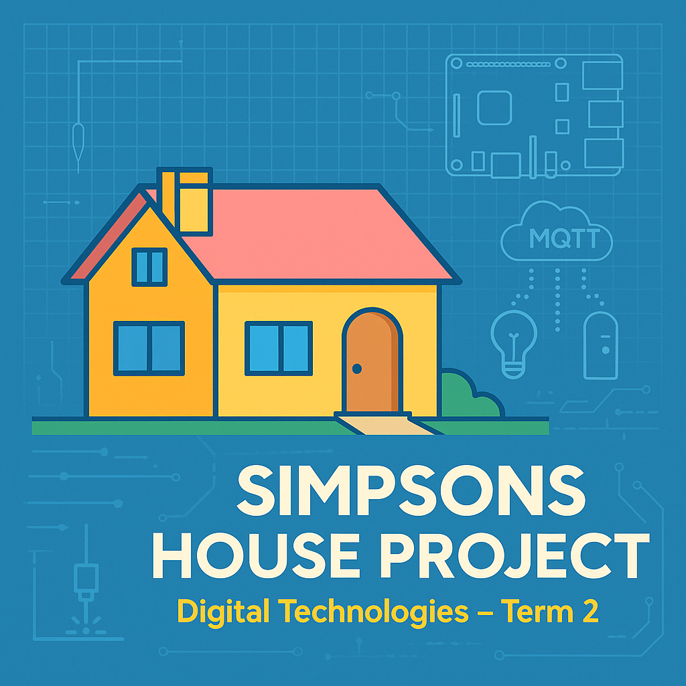
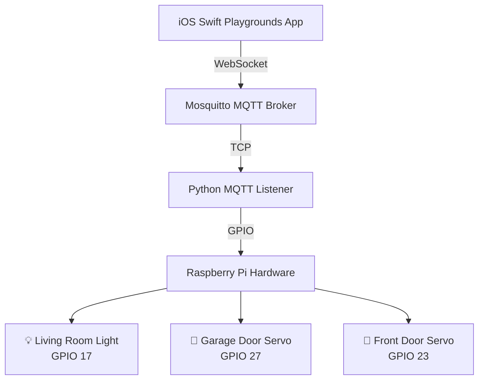

# 🏠 Simpson's House Smart Home Control

A comprehensive smart home automation project that allows you to control LEDs and servo-driven garage and front doors on a Raspberry Pi directly from an iOS Swift Playgrounds app using **MQTT over WebSocket**.

[](https://github.com/roanvtkc/simpsons-house)
[](https://mqtt.org/)
[](https://www.apple.com/swift/playgrounds/)
[](https://www.raspberrypi.org/)
[](LICENSE)

<p align="center">
  
</p>


## ✨ Features

- **🏠 Smart Home Control**: Complete home automation system inspired by The Simpsons
- **📱 iOS App**: Beautiful SwiftUI interface built for Swift Playgrounds
- **🌐 MQTT over WebSocket**: Modern, reliable communication protocol
- **🔧 GPIO Control**: Direct hardware control of LEDs and servo motors
- **⚙️ Servo Control**: PWM angle control on both the garage door and the front door
- **📡 Real-time Communication**: Instant response and status feedback
- **🔄 Auto-reconnection**: Robust connection handling with keep-alive pings
- **🕵️ mDNS Discovery**: Automatic network device discovery
- **⚙️ Systemd Integration**: Professional service management

## 📚 Guides

| Guide | What it covers |
|---|---|
| [WIRING_GUIDE.md](WIRING_GUIDE.md) | Identifying each component, breadboard layout, per-device troubleshooting |
| [SERVO_TUNING_GUIDE.md](SERVO_TUNING_GUIDE.md) | Changing how far the doors open, reversing direction, slowing the movement |
| [EXTENSION_GUIDE.md](EXTENSION_GUIDE.md) | Adding your own circuits — the Python side and the Swift app side |
| [TEACHING_GUIDE.md](TEACHING_GUIDE.md) | How a tap on the iPad becomes movement on the Pi |
| [laser-cut/README.md](laser-cut/README.md) | DXF sheets, part chart, layer settings |

## 🔥 Laser-cut plans

Ready-to-import DXF plans are available for two or ten houses on a 450 × 450 mm
bed, plus a ten-house 600 × 450 mm option. See the
[laser-cut guide](laser-cut/README.md) for the sheet files, previews, part chart,
layer settings, and verification results.

## 🏗️ System Architecture


```mermaid
graph TD
    A[iOS Swift Playgrounds App] -->|WebSocket| B[Mosquitto MQTT Broker]
    B -->|TCP| C[Python MQTT Listener]
    C -->|GPIO| D[Raspberry Pi Hardware]
    
    D --> E[💡 Living Room Light<br/>GPIO 17]
    D --> F[🚗 Garage Door Servo<br/>GPIO 27]
    D --> G[🚪 Front Door Servo<br/>GPIO 23]
```

## 📋 Prerequisites

- **Raspberry Pi** running Raspberry Pi OS (32-bit or 64-bit)
- **SSH access** to the Pi (default credentials: `pi`/`tkcraspberry`)
  > 📱 **iPad SSH client**: We recommend [**Secure ShellFish**](https://secureshellfish.app) — no account required, saves sessions, and has a proper iOS keyboard toolbar. Free tier is sufficient for this project.
- **Git installed** on the Pi (will be installed automatically if missing)
- **iOS device** with Swift Playgrounds 4+ or macOS with Xcode 13+
- **Hardware components**: LEDs, resistors, two SG90 servo motors (garage door and front door), breadboard
- **Same network**: Both devices must be on the same local network

## 🚀 Quick Start

### 0. Certificate Installation (Corporate Networks Only)

If you're in a corporate environment with FortiGate firewalls or other SSL inspection systems, `setup.sh` will fail at the "Upgrading pip and setuptools" step with certificate errors like:

```
ERROR: Could not find a version that satisfies the requirement setuptools (from versions: none)
ERROR: No matching distribution found for setuptools
```

with `SSLError(SSLCertVerificationError(... self-signed certificate in certificate chain))` above it in `/tmp/simpsons_house_debug.log`.

**Quick Certificate Installation:**
```bash
# Run the certificate installer from this repo
chmod +x install_ca.sh
./install_ca.sh
```

> **Note:** run the copy in this repo. A copy is also published at
> `http://10.20.1.83:8081/install_ca.sh`, but it may lag behind this one.

The installer adds the FortiGate SSL-inspection CA (`O=Fortinet`) to the system
trust store. Note that `git clone` from GitHub works *without* this — github.com
is exempt from deep inspection — so a successful clone is not evidence that the
certificate is installed. The Python package indexes (pypi.org, piwheels.org,
files.pythonhosted.org) *are* inspected, which is why `setup.sh` fails without it.

### 1. Hardware Setup

#### 🔌 GPIO Pin Layout (BCM Numbering)

```
    3V3  (1) (2)  5V
  GPIO2  (3) (4)  5V
  GPIO3  (5) (6)  GND
  GPIO4  (7) (8)  GPIO14
    GND  (9) (10) GPIO15
 GPIO17 (11) (12) GPIO18
 GPIO27 (13) (14) GND
 GPIO22 (15) (16) GPIO23
    3V3 (17) (18) GPIO24
 GPIO10 (19) (20) GND
  GPIO9 (21) (22) GPIO25
 GPIO11 (23) (24) GPIO8
    GND (25) (26) GPIO7
  GPIO0 (27) (28) GPIO1
  GPIO5 (29) (30) GND
  GPIO6 (31) (32) GPIO12
 GPIO13 (33) (34) GND
 GPIO19 (35) (36) GPIO16
 GPIO26 (37) (38) GPIO20
    GND (39) (40) GPIO21
```

#### 🔧 Wiring

> 📖 **See [WIRING_GUIDE.md](WIRING_GUIDE.md) for the full step-by-step wiring instructions**, including how to identify each component, breadboard layouts, common mistakes, and per-device troubleshooting.

Quick reference — connections at a glance:

**💡 Living Room Light (GPIO 17 → physical pin 11)**
```
Pi GPIO 17 (pin 11) ─── 220Ω resistor ─── LED (+) long leg
                                           LED (−) short leg ─── Pi GND (pin 9)
```
Key fact: the **longer LED leg is +**; it goes toward GPIO 17. The shorter leg goes to GND.

**🚗 Garage Door — Servo Motor (GPIO 27 → physical pin 13)**
```
Pi GPIO 27 (pin 13) ─── Servo SIGNAL wire (orange / yellow / white)
Pi 5V      (pin  2) ─── Servo POWER wire  (red)
Pi GND     (pin 14) ─── Servo GROUND wire (brown / black)
```
Key fact: **red is always power**; if your servo has different colours, red is still VCC.

**🚪 Front Door — Servo Motor (GPIO 23 → physical pin 16)**
```
Pi GPIO 23 (pin 16) ─── Servo SIGNAL wire (orange / yellow / white)
Pi 5V      (pin  4) ─── Servo POWER wire  (red)
Pi GND     (pin  6) ─── Servo GROUND wire (brown / black)
```
Key fact: **red is always power**; if your servo has different colours, red is still VCC.

#### 📋 Component List

| Component | Quantity | Notes |
|-----------|----------|-------|
| LED (any color) | 1 | For light indication |
| 220Ω Resistor | 1 | For LED current limiting |
| Servo Motor (SG90) | 2 | One for the garage door, one for the front door |
| Breadboard | 1 | For prototyping |
| Jumper Wires | 15+ | Male-to-female recommended |
| Breadboard Power Module | 1 | Optional, for cleaner power distribution |

#### ⚠️ Safety Notes

- **Two SG90 servos run fine on Pi 5V**: they draw little enough current that no external supply or driver board is needed
- **Never use Pi power for high-current motors**
- **Double-check connections** before powering on
- **Use appropriate resistors** to prevent LED burnout
- **Servo direction**: check which way each servo swings before gluing it into the model
- **Common Ground**: if you do add external power, its GND must be connected to Pi GND

#### 🔍 Pin Verification

Use this command to see the physical pin layout:
```bash
pinout
```

### 2. Raspberry Pi Setup

**Install Git (if needed):**

On your Raspberry Pi, if you see `git: command not found` when trying to clone:
```bash
sudo apt update
sudo apt install -y git
```

**Clone the repository:**
```bash
git clone https://github.com/roanvtkc/simpsons-house.git
cd simpsons-house
```

**Run the automated setup:**
```bash
chmod +x setup.sh
./setup.sh
```

The setup script will:
- ✅ Install all required packages (including git if missing)
- ✅ Configure MQTT with WebSocket support (ports 1883 and 9001)
- ✅ Set up Python environment and GPIO control
- ✅ Create systemd services for automatic startup
- ✅ Configure mDNS for device discovery
- ✅ Test all components

### 3. iOS App Setup

1. **Open Swift Playgrounds** on your iOS device
2. **Create a new playground** or import the provided Swift package
3. **Copy the Simpson's House app code** into your playground
4. **Update the IP address** if needed (the app defaults to `192.168.5.115`)
5. **Run the app** and grant Local Network permissions when prompted

## 🎮 Using the App

### Connection
1. **Tap "Connect to House"** to establish MQTT over WebSocket connection
2. **Wait for "🏠 Simpson's House Connected!"** status
3. **Start controlling your devices!**

### Device Controls
- **💡 Living Room Light**: Toggle the main lighting
- **🚗 Garage Door**: Open and close using the garage servo
  - `OPEN`: Turn motor to open the door
  - `CLOSE`: Turn motor to close the door
  - Future: Variable speed control via PWM
- **🚪 Front Door**: Operate the servo-controlled entrance

### Features
- **📊 Real-time status**: See device states instantly
- **📋 Activity logs**: Monitor all commands and responses
- **ℹ️ System info**: View hardware and network configuration
- **🔄 Auto-reconnect**: Automatic connection recovery

## 🛠️ Configuration

### MQTT Topics
| Topic | Description | Commands |
|-------|-------------|----------|
| `home/light` | Living room light control | `ON`, `OFF` |
| `home/garage` | garage door servo (GPIO 27) | `OPEN`, `CLOSE` |
| `home/door` | Front door servo | `ON` (open), `OFF` (close) |

### Network Ports
- **1883**: MQTT TCP (standard MQTT clients)
- **9001**: MQTT WebSocket (iOS app)

### Service Management
```bash
# Check status
sudo systemctl status simpsons-house
sudo systemctl status mosquitto

# View logs
sudo journalctl -u simpsons-house -f
sudo journalctl -u mosquitto -f

# Restart services
sudo systemctl restart simpsons-house
sudo systemctl restart mosquitto

# Test MQTT manually
mosquitto_pub -h localhost -t home/light -m ON
mosquitto_pub -h localhost -t home/garage -m OPEN
mosquitto_sub -h localhost -t home/# -v
```

## 🔧 Advanced Configuration

### Custom GPIO Pins
Edit `mqttlistener.py` to change pin assignments:
```python
# GPIO pin assignments (BCM numbering)
LIGHT_PIN        = 17   # Light control
GARAGE_SERVO_PIN = 27   # Garage door servo signal
SERVO_PIN        = 23   # Front door servo signal
```

### Servo Angles
The front door and garage door angles are set in `control_door()` and `control_garage_door()` in `mqttlistener.py`:
```python
angle = 90 if state else 0   # OPEN = 90°, CLOSED = 0°
```

> 📖 **See [SERVO_TUNING_GUIDE.md](SERVO_TUNING_GUIDE.md)** for how to find the right angles for your model, reverse a door's direction, and slow the movement down — plus `servo_calibrate.py`, an interactive tool for jogging each servo to find its angles.

### Network Settings
Update the iOS app host address:
```swift
@StateObject private var mqttClient = SimpsonsHouseMQTTClient(host: "YOUR_PI_IP_ADDRESS")
```

## 🧪 Testing & Verification

### Test GPIO Pins Before MQTT Setup

**Run the built-in hardware test:**
```bash
cd ~/simpsons-house
python3 gpio_test.py
```

It walks the light and both servos in turn. If you want to try a single servo by
hand, this is the minimum:
```python
#!/usr/bin/env python3
import RPi.GPIO as GPIO
import time

GARAGE_SERVO_PIN = 27          # use 23 for the front door servo

GPIO.setmode(GPIO.BCM)
GPIO.setup(GARAGE_SERVO_PIN, GPIO.OUT)
pwm = GPIO.PWM(GARAGE_SERVO_PIN, 50)   # 50 Hz is the hobby-servo standard
pwm.start(0)

try:
    for angle in (0, 90, 0):
        pwm.ChangeDutyCycle((angle / 180.0) * 10 + 2)   # 0° → 2%, 180° → 12%
        time.sleep(0.8)                                  # let the servo travel
        pwm.ChangeDutyCycle(0)                           # stop pulsing, avoid jitter
        time.sleep(0.5)
finally:
    pwm.stop()
    GPIO.cleanup()
```

### Expected Results:
- **💡 Light LED**: Should turn ON for 2 seconds, then OFF
- **🚗 Garage door servo**: Should swing from 0° (closed) to 90° (open) and back
- **🚪 Front door servo**: Should move from 0° to 90° and back to 0°

### Verify Services
```bash
# Check MQTT broker
sudo systemctl status mosquitto

# Check listening ports (should show both 1883 and 9001)
sudo netstat -tlnp | grep -E "(1883|9001)"

# Test MQTT broker
mosquitto_pub -h localhost -t test/message -m "Hello Simpson's House"
mosquitto_sub -h localhost -t test/# -v

# Check mDNS discovery
avahi-browse -rt _mqtt._tcp
```

### Test Motor Control
```bash
# Test individual devices
mosquitto_pub -h localhost -t home/light -m ON
mosquitto_pub -h localhost -t home/garage -m OPEN   # Open garage door
mosquitto_pub -h localhost -t home/garage -m CLOSE  # Close garage door
mosquitto_pub -h localhost -t home/door -m ON   # Servo open
```

## 🐛 Troubleshooting

<details>
<summary><strong>Servo Motor Issues</strong></summary>

**Servo doesn't move:**
- Check the signal wire is on the right pin — GPIO 27 (pin 13) for the garage, GPIO 23 (pin 16) for the front door
- Red wire must be on Pi 5V, not 3.3V — a servo on 3.3V often twitches but won't hold
- Ensure the servo GND is connected to Pi GND
- Confirm nothing else is holding the pin: `sudo fuser /dev/gpiomem`

**Servo jitters or hums when idle:**
- Expected if pulses keep being sent. The code calls `ChangeDutyCycle(0)` after each move to stop this — check it isn't commented out
- Both servos on Pi 5V can brown out the Pi if they move at the same instant under load; add an external 5V supply (GND common with the Pi) if so

**Servo moves the wrong way:**
- Swap the angles in `control_garage_door()` / `control_door()` — the code maps OPEN = 90°, CLOSED = 0°
- Or remount the horn 90° round on the spline

**Servo doesn't reach full travel:**
- SG90s vary; adjust the 2%–12% duty range in `set_servo_angle()` to suit your unit
- Check the door isn't binding on the model before blaming the servo
</details>

<details>
<summary><strong>GPIO & Hardware Issues</strong></summary>

**Check GPIO status:**
```bash
# See pin layout
pinout

# Check what's using GPIO pins
sudo fuser /dev/gpiomem
```

**Manual servo testing:**

A servo needs a continuous 50 Hz pulse train, so it cannot be driven from the
shell the way an LED can — use the Python snippet in
[Testing & Verification](#-testing--verification) above, or `gpio_test.py`.

**Common servo wiring issues:**
- Signal on the wrong pin: garage is GPIO 27 (pin 13), front door is GPIO 23 (pin 16)
- Power on 3.3V instead of 5V — always use a 5V pin for the red wire
- Missing common ground between servo and Pi
- Connector reversed: check the wire colours, not the plug orientation — red is always power
</details>

### Log Locations
- **Setup logs**: `/tmp/simpsons_house_setup.log`
- **MQTT listener**: `sudo journalctl -u simpsons-house -f`
- **Mosquitto broker**: `/var/log/mosquitto/mosquitto.log`
- **System logs**: `sudo journalctl -f`

## 🔒 Security Considerations

> ⚠️ **Important**: This project uses `allow_anonymous true` for simplicity. For production use:

- Enable MQTT authentication with username/password
- Use TLS/SSL encryption for MQTT connections
- Configure firewall rules to limit access
- Regular security updates for all components
- Consider VPN access for remote control

## 📁 Project Structure

```
simpsons-house/
├── 📄 README.md                    # This file
├── 📖 SERVO_TUNING_GUIDE.md         # Adjusting door angles, direction and speed
├── 📖 EXTENSION_GUIDE.md            # Adding your own circuits (Python + Swift)
├── 🔧 setup.sh                     # Automated setup script
├── 🐍 mqttlistener.py               # Python MQTT listener with servo control
├── 🔐 install_ca.sh                # FortiGate certificate installer
├── 🧪 gpio_test.py                  # Hardware test: light + both servos
├── 🎛️  servo_calibrate.py            # Interactive servo angle finder
├── 🧪 stepper_test.py                # DEPRECATED — old stepper test, kept for reference
├── 📱 ios-app/                     # Swift Playgrounds app code
│   └── ContentView.swift
├── 📋 systemd/                     # Systemd service files
│   └── simpsons-house.service
└── 📊 docs/                        # Additional documentation
    ├── hardware-setup.md
    ├── troubleshooting.md
    └── api-reference.md
```

## 🤝 Contributing

We welcome contributions! Please see our [Contributing Guide](CONTRIBUTING.md) for details.

### Development Setup
1. **Fork the repository**
2. **Create a feature branch**: `git checkout -b feature/amazing-feature`
3. **Commit changes**: `git commit -m 'Add amazing feature'`
4. **Push to branch**: `git push origin feature/amazing-feature`
5. **Open a Pull Request**

## 📄 License

This project is licensed under the MIT License - see the [LICENSE](LICENSE) file for details.

## 🎯 Roadmap

### Upcoming Features
- [ ] **Variable motor speed** control via PWM
- [ ] **Motor direction reversal** commands
- [ ] **Current sensing** for motor load monitoring
- [ ] **Temperature sensors** and climate control
- [ ] **Motion detection** and security features
- [ ] **Voice control** integration (Siri Shortcuts)
- [ ] **Web dashboard** for browser control

### Version History
- **v3.3** - Garage door moved from a 28BYJ-48 stepper + ULN2003 to an SG90 servo on GPIO 27
- **v3.1** - ULN2003 motor driver integration, improved motor control
- **v3.0** - MQTT over WebSocket support, systemd integration
- **v2.0** - Basic MQTT control with GPIO
- **v1.0** - Initial HTTP-based control system

## 📞 Support

### Getting Help
- 📖 Check the [Documentation](docs/)
- 🐛 [Report Issues](https://github.com/roanvtkc/simpsons-house/issues)
- 💬 [Discussions](https://github.com/roanvtkc/simpsons-house/discussions)
- ❓ [FAQ](docs/faq.md)

### Community
- 🌟 **Star this repo** if you find it useful!
- 🐦 Follow updates on Twitter: [@SimpsonsHousePi](https://twitter.com/simpsonshousepi)
- 💡 Share your builds and modifications

---

**Made with ❤️ for smart home enthusiasts and Simpsons fans**

For support and questions, please [open an issue](https://github.com/roanvtkc/simpsons-house/issues) or check our [troubleshooting guide](docs/troubleshooting.md).
