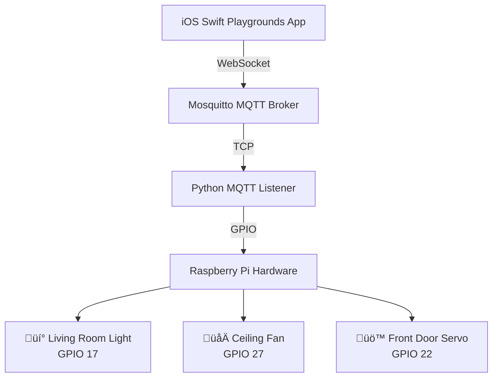

<details>
<summary><strong>GPIO & Hardware Issues</strong></summary>

**Test GPIO pins before MQTT setup:**
```bash
# Install GPIO utilities
sudo apt install -y wiringpi gpio-utils

# Test individual pins
gpio mode 17 out
gpio write 17 1  # Turn ON
gpio write 17 0  # Turn OFF

# Check pin states in real-time
watch -n 1 'gpio readall'
```

**Python GPIO test script:**
```python
#!/usr/bin/env python3
import RPi.GPIO as GPIO
import time

# Test all GPIO pins
LIGHT_PIN = 17
FAN_PIN = 27
SERVO_PIN = 22

GPIO.setmode(GPIO.BCM)
GPIO.setup(LIGHT_PIN, GPIO.OUT)
GPIO.setup(FAN_PIN, GPIO.OUT)
GPIO.setup(SERVO_PIN, GPIO.OUT)

# Test each device
print("Testing Light...")
GPIO.output(LIGHT_PIN, GPIO.HIGH)
time.sleep(2)
GPIO.output(LIGHT_PIN, GPIO.LOW)

print("Testing Fan...")
GPIO.output(FAN_PIN, GPIO.HIGH) 
time.sleep(2)
GPIO.output(FAN_PIN, GPIO.LOW)

GPIO.cleanup()
```

**Common GPIO issues:**
- Double-check wiring against the GPIO diagram
- Use BCM pin numbers, not physical pin numbers
- Check LED polarity (longer leg = positive)
- Ensure 220Ω resistors for LEDs
- Servo needs 5V power, not 3.3V
- All components must share common ground

**Test with multimeter:**
- GPIO HIGH should show 3.3V
- Check continuity of connections
- Verify component values (resistors, etc.)
</details><details>
<summary><strong>SSH Issues</strong></summary>

**"Host key verification failed" or "Remote host identification has changed":**
```bash
ssh-keygen -R 192.168.5.115
```
Then retry the SSH connection and accept the new host key when prompted.

**Cannot connect via SSH:**
- Verify SSH is enabled: `sudo systemctl enable ssh`
- Check if SSH service is running: `sudo systemctl status ssh`
- Ensure you're using the correct IP address: `hostname -I`
</details># 🏠 Simpson's House Smart Home Control

A comprehensive smart home automation project that allows you to control LEDs, fans, and servos on a Raspberry Pi directly from an iOS Swift Playgrounds app using **MQTT over WebSocket**.

[](https://github.com/roanvtkc/simpsons-house)
[](https://mqtt.org/)
[](https://www.apple.com/swift/playgrounds/)
[](https://www.raspberrypi.org/)
[](LICENSE)


## ✨ Features

- **🏠 Smart Home Control**: Complete home automation system inspired by The Simpsons
- **📱 iOS App**: Beautiful SwiftUI interface built for Swift Playgrounds
- **🌐 MQTT over WebSocket**: Modern, reliable communication protocol
- **🔧 GPIO Control**: Direct hardware control of LEDs, fans, and servo motors
- **📡 Real-time Communication**: Instant response and status feedback
- **🔄 Auto-reconnection**: Robust connection handling with keep-alive pings
- **🕵️ mDNS Discovery**: Automatic network device discovery
- **⚙️ Systemd Integration**: Professional service management

## 🏗️ System Architecture



## 📋 Prerequisites

- **Raspberry Pi** running Raspberry Pi OS (32-bit or 64-bit)
- **SSH access** to the Pi (default credentials: `pi`/`tkcraspberry`)
- **Git installed** on the Pi (will be installed automatically if missing)
- **iOS device** with Swift Playgrounds 4+ or macOS with Xcode 13+
- **Hardware components**: LEDs, resistors, servo motor, breadboard
- **Same network**: Both devices must be on the same local network

## 🚀 Quick Start

### 1. Hardware Setup

#### 🔌 GPIO Pin Layout (BCM Numbering)

```
    3V3  (1) (2)  5V
  GPIO2  (3) (4)  5V
  GPIO3  (5) (6)  GND
  GPIO4  (7) (8)  GPIO14
    GND  (9) (10) GPIO15
 GPIO17 (11) (12) GPIO18
 GPIO27 (13) (14) GND
 GPIO22 (15) (16) GPIO23
    3V3 (17) (18) GPIO24
 GPIO10 (19) (20) GND
  GPIO9 (21) (22) GPIO25
 GPIO11 (23) (24) GPIO8
    GND (25) (26) GPIO7
  GPIO0 (27) (28) GPIO1
  GPIO5 (29) (30) GND
  GPIO6 (31) (32) GPIO12
 GPIO13 (33) (34) GND
 GPIO19 (35) (36) GPIO16
 GPIO26 (37) (38) GPIO20
    GND (39) (40) GPIO21
```

#### 🔧 Wiring Diagram

**💡 Living Room Light (GPIO 17 - Pin 11):**
```
GPIO 17 (Pin 11) ──── 220Ω Resistor ──── LED (+) 
                                         LED (-) ──── GND (Pin 9)
```

**🌀 Ceiling Fan (GPIO 27 - Pin 13):**
```
GPIO 27 (Pin 13) ──── 220Ω Resistor ──── LED (+)
                                         LED (-) ──── GND (Pin 14)

# For actual fan (with transistor):
GPIO 27 (Pin 13) ──── 1kΩ Resistor ──── NPN Transistor Base
                      Transistor Emitter ──── GND
                      Transistor Collector ──── Fan (-)
                      Fan (+) ──── 5V (Pin 4)
```

**🚪 Front Door Servo (GPIO 22 - Pin 15):**
```
GPIO 22 (Pin 15) ──── Servo Signal (Yellow/Orange)
5V (Pin 4) ──────────── Servo VCC (Red)
GND (Pin 6) ─────────── Servo GND (Brown/Black)
```

#### 📋 Component List

| Component | Quantity | Notes |
|-----------|----------|-------|
| LED (any color) | 2 | For light and fan indication |
| 220Ω Resistor | 2 | For LED current limiting |
| Servo Motor (SG90) | 1 | Standard 3-wire servo |
| Breadboard | 1 | For prototyping |
| Jumper Wires | 10+ | Male-to-female recommended |
| NPN Transistor (optional) | 1 | 2N2222 for real fan control |
| 1kΩ Resistor (optional) | 1 | For transistor base |

#### ⚠️ Safety Notes

- **Double-check connections** before powering on
- **Use appropriate resistors** to prevent LED burnout
- **Never connect LEDs directly** to GPIO without resistors
- **For high-current devices** (real fans), always use transistors or relays
- **Servo power**: Use 5V pin, not 3.3V
- **Common ground**: Ensure all components share the same ground

#### 🔍 Pin Verification

Use this command to see the physical pin layout:
```bash
pinout
```

### 2. Raspberry Pi Setup

**Install Git (if needed):**

On your Raspberry Pi, if you see `git: command not found` when trying to clone:
```bash
sudo apt update
sudo apt install -y git
```

**Clone the repository:**
```bash
git clone https://github.com/roanvtkc/simpsons-house.git
cd simpsons-house
```

**Run the automated setup:**
```bash
chmod +x setup.sh
./setup.sh
```

The setup script will:
- ✅ Install all required packages (including git if missing)
- ✅ Configure MQTT with WebSocket support (ports 1883 and 9001)
- ✅ Set up Python environment and GPIO control
- ✅ Create systemd services for automatic startup
- ✅ Configure mDNS for device discovery
- ✅ Test all components

### 3. iOS App Setup

1. **Open Swift Playgrounds** on your iOS device
2. **Create a new playground** or import the provided Swift package
3. **Copy the Simpson's House app code** into your playground
4. **Update the IP address** if needed (the app defaults to `192.168.5.115`)
5. **Run the app** and grant Local Network permissions when prompted

## 🎮 Using the App

### Connection
1. **Tap "Connect to House"** to establish MQTT over WebSocket connection
2. **Wait for "🏠 Simpson's House Connected!"** status
3. **Start controlling your devices!**

### Device Controls
- **💡 Living Room Light**: Toggle the main lighting
- **🌀 Ceiling Fan**: Control climate systems  
- **🚪 Front Door**: Operate the servo-controlled entrance

### Features
- **📊 Real-time status**: See device states instantly
- **📋 Activity logs**: Monitor all commands and responses
- **ℹ️ System info**: View hardware and network configuration
- **🔄 Auto-reconnect**: Automatic connection recovery

## 🛠️ Configuration

### MQTT Topics
| Topic | Description | Commands |
|-------|-------------|----------|
| `home/light` | Living room light control | `ON`, `OFF` |
| `home/fan` | Ceiling fan control | `ON`, `OFF` |
| `home/door` | Front door servo | `ON` (open), `OFF` (close) |

### Network Ports
- **1883**: MQTT TCP (standard MQTT clients)
- **9001**: MQTT WebSocket (iOS app)

### Service Management
```bash
# Check status
sudo systemctl status simpsons-house
sudo systemctl status mosquitto

# View logs
sudo journalctl -u simpsons-house -f
sudo journalctl -u mosquitto -f

# Restart services
sudo systemctl restart simpsons-house
sudo systemctl restart mosquitto

# Test MQTT manually
mosquitto_pub -h localhost -t home/light -m ON
mosquitto_sub -h localhost -t home/# -v
```

## 🔧 Advanced Configuration

### Custom GPIO Pins
Edit `mqttlistener.py` to change pin assignments:
```python
# GPIO pin assignments (BCM numbering)
LIGHT_PIN = 17  # Change to your preferred pin
FAN_PIN   = 27  # Change to your preferred pin  
SERVO_PIN = 22  # Change to your preferred pin
```

### Network Settings
Update the iOS app host address:
```swift
@StateObject private var mqttClient = SimpsonsHouseMQTTClient(host: "YOUR_PI_IP_ADDRESS")
```

### FortiGate Environments
If you're in a corporate environment with FortiGate firewalls:
- The setup script will prompt for certificate installation
- Choose 'y' if you need certificate inspection bypass
- Choose 'n' for home networks

## 🧪 Testing & Verification

### Test GPIO Pins Before MQTT Setup

**Install GPIO utilities:**
```bash
sudo apt update
sudo apt install -y wiringpi gpio-utils
```

**Test individual GPIO pins:**
```bash
# Test Light (GPIO 17)
gpio mode 17 out
gpio write 17 1  # Turn ON
sleep 2
gpio write 17 0  # Turn OFF

# Test Fan (GPIO 27) 
gpio mode 27 out
gpio write 27 1  # Turn ON
sleep 2
gpio write 27 0  # Turn OFF

# Test Servo (GPIO 22) - Basic test
gpio mode 22 pwm
gpio pwm 22 150  # Middle position
sleep 2
gpio pwm 22 50   # One direction
sleep 2
gpio pwm 22 250  # Other direction
```

**Python GPIO Test Script:**
Create a test file to verify your wiring:
```bash
nano gpio_test.py
```

Copy this test script:
```python
#!/usr/bin/env python3
import RPi.GPIO as GPIO
import time

# GPIO pins (BCM numbering)
LIGHT_PIN = 17
FAN_PIN = 27
SERVO_PIN = 22

def test_gpio():
    GPIO.setmode(GPIO.BCM)
    GPIO.setwarnings(False)
    
    # Setup pins
    GPIO.setup(LIGHT_PIN, GPIO.OUT)
    GPIO.setup(FAN_PIN, GPIO.OUT)
    GPIO.setup(SERVO_PIN, GPIO.OUT)
    
    # Setup servo PWM
    servo_pwm = GPIO.PWM(SERVO_PIN, 50)  # 50Hz
    servo_pwm.start(0)
    
    try:
        print("🧪 Testing Simpson's House GPIO pins...")
        
        # Test Light
        print("💡 Testing Light (GPIO 17)...")
        GPIO.output(LIGHT_PIN, GPIO.HIGH)
        print("   Light should be ON - Check your LED!")
        time.sleep(3)
        GPIO.output(LIGHT_PIN, GPIO.LOW)
        print("   Light should be OFF")
        time.sleep(1)
        
        # Test Fan
        print("🌀 Testing Fan (GPIO 27)...")
        GPIO.output(FAN_PIN, GPIO.HIGH)
        print("   Fan should be ON - Check your LED/Fan!")
        time.sleep(3)
        GPIO.output(FAN_PIN, GPIO.LOW)
        print("   Fan should be OFF")
        time.sleep(1)
        
        # Test Servo
        print("🚪 Testing Door Servo (GPIO 22)...")
        print("   Servo moving to 0° (closed)")
        servo_pwm.ChangeDutyCycle(2)  # 0 degrees
        time.sleep(1)
        servo_pwm.ChangeDutyCycle(0)
        time.sleep(2)
        
        print("   Servo moving to 90° (open)")
        servo_pwm.ChangeDutyCycle(7)  # 90 degrees
        time.sleep(1)
        servo_pwm.ChangeDutyCycle(0)
        time.sleep(2)
        
        print("   Servo returning to 0° (closed)")
        servo_pwm.ChangeDutyCycle(2)  # 0 degrees
        time.sleep(1)
        servo_pwm.ChangeDutyCycle(0)
        
        print("✅ GPIO test completed!")
        print("   If devices didn't work, check your wiring!")
        
    except KeyboardInterrupt:
        print("\n🛑 Test interrupted")
    finally:
        servo_pwm.stop()
        GPIO.cleanup()
        print("🧹 GPIO cleaned up")

if __name__ == "__main__":
    test_gpio()
```

**Run the GPIO test:**
```bash
python3 gpio_test.py
```

**Expected Results:**
- **💡 Light LED**: Should turn ON for 3 seconds, then OFF
- **🌀 Fan LED**: Should turn ON for 3 seconds, then OFF  
- **🚪 Servo**: Should move from 0° to 90° and back to 0°

### Verify Services
```bash
# Check MQTT broker
sudo systemctl status mosquitto

# Check listening ports (should show both 1883 and 9001)
sudo netstat -tlnp | grep -E "(1883|9001)"

# Test MQTT broker
mosquitto_pub -h localhost -t test/message -m "Hello Simpson's House"
mosquitto_sub -h localhost -t test/# -v

# Check mDNS discovery
avahi-browse -rt _mqtt._tcp
```

### Test GPIO Control
```bash
# Test individual devices
mosquitto_pub -h localhost -t home/light -m ON
mosquitto_pub -h localhost -t home/fan -m OFF
mosquitto_pub -h localhost -t home/door -m ON
```

### Test WebSocket Connection
You can test the WebSocket from a browser:
```javascript
// Open browser console and test WebSocket
const ws = new WebSocket('ws://192.168.5.115:9001');
ws.onopen = () => console.log('WebSocket connected!');
ws.onerror = (error) => console.log('WebSocket error:', error);
```

## 🐛 Troubleshooting

<details>
<summary><strong>Setup Issues</strong></summary>

**"git: command not found" error:**
```bash
sudo apt update
sudo apt install -y git
```
Then retry the git clone command.

**"Permission denied" when running setup:**
```bash
chmod +x setup.sh
./setup.sh
```
Make sure you're running as the `pi` user, not root.
</details>

<details>
<summary><strong>Connection Issues</strong></summary>

**"Connection timeout" in iOS app:**
- Verify both devices are on the same WiFi network
- Check Pi IP address: `hostname -I`
- Test WebSocket manually: Use browser to visit `ws://PI_IP:9001`

**"Service failed to start":**
```bash
# Check service logs
sudo journalctl -u simpsons-house -n 50
sudo journalctl -u mosquitto -n 50

# Restart services
sudo systemctl restart mosquitto
sudo systemctl restart simpsons-house
```
</details>

<details>
<summary><strong>WebSocket Issues</strong></summary>

**"WebSocket connection refused":**
- Verify Mosquitto WebSocket port: `sudo netstat -tlnp | grep 9001`
- Check Mosquitto config: `cat /etc/mosquitto/conf.d/01-simpsons-house.conf`
- Test from command line: `mosquitto_pub -h localhost -t test -m hello`
</details>

<details>
<summary><strong>GPIO Issues</strong></summary>

**"GPIO permissions denied":**
- Ensure the script runs as `pi` user (not root)
- Verify user is in `gpio` group: `groups pi`
- Check systemd service user: `sudo systemctl show simpsons-house | grep User`
</details>

<details>
<summary><strong>Network Discovery Issues</strong></summary>

**"mDNS discovery not working":**
- Check Avahi: `sudo systemctl status avahi-daemon`
- Enable Local Network in iOS Settings → Privacy → Local Network
- Add `_mqtt._tcp` service in Swift Playgrounds capabilities
</details>

### Log Locations
- **Setup logs**: `/tmp/simpsons_house_setup.log`
- **MQTT listener**: `sudo journalctl -u simpsons-house -f`
- **Mosquitto broker**: `/var/log/mosquitto/mosquitto.log`
- **System logs**: `sudo journalctl -f`

### Debug Commands
```bash
# Check all Simpson's House processes
ps aux | grep -E "(mosquitto|mqtt|python)"

# Check network connectivity
ping 192.168.5.115  # From iOS device to Pi

# Verify WebSocket listener
telnet 192.168.5.115 9001

# Monitor GPIO states in real-time
watch -n 1 'gpio readall'

# Test GPIO pins manually
gpio write 17 1  # Turn on light
gpio write 27 1  # Turn on fan
gpio write 22 1  # Activate servo pin

# Check MQTT message flow
mosquitto_sub -h localhost -t home/# -v &
mosquitto_pub -h localhost -t home/light -m ON
```

## 🔒 Security Considerations

> ⚠️ **Important**: This project uses `allow_anonymous true` for simplicity. For production use:

- Enable MQTT authentication with username/password
- Use TLS/SSL encryption for MQTT connections
- Configure firewall rules to limit access
- Regular security updates for all components
- Consider VPN access for remote control

## 📱 Swift Playgrounds Configuration

### Required Info.plist entries:
```xml
<key>NSLocalNetworkUsageDescription</key>
<string>Needs local network access to connect to MQTT broker</string>
<key>NSBonjourServices</key>
<array>
    <string>_mqtt._tcp</string>
</array>
```

### App Capabilities:
- **Local Network**: Enable in Settings → Privacy → Local Network
- **Swift Playgrounds**: Allow in Local Network settings
- **Background App Refresh**: Enable for persistent connections

## 📁 Project Structure

```
simpsons-house/
├── 📄 README.md                    # This file
├── 🔧 setup.sh                     # Automated setup script
├── 🐍 mqttlistener.py               # Python MQTT listener
├── 🔐 install_ca.sh                # FortiGate certificate installer
├── 📱 ios-app/                     # Swift Playgrounds app code
│   └── ContentView.swift
├── 📋 systemd/                     # Systemd service files
│   └── simpsons-house.service
└── 📊 docs/                        # Additional documentation
    ├── hardware-setup.md
    ├── troubleshooting.md
    └── api-reference.md
```

## 🤝 Contributing

We welcome contributions! Please see our [Contributing Guide](CONTRIBUTING.md) for details.

### Development Setup
1. **Fork the repository**
2. **Create a feature branch**: `git checkout -b feature/amazing-feature`
3. **Commit changes**: `git commit -m 'Add amazing feature'`
4. **Push to branch**: `git push origin feature/amazing-feature`
5. **Open a Pull Request**

### Code Style
- **Python**: Follow PEP 8 guidelines
- **Swift**: Follow Swift API Design Guidelines
- **Bash**: Use shellcheck for script validation

## 📄 License

This project is licensed under the MIT License - see the [LICENSE](LICENSE) file for details.

## 🎯 Roadmap

### Upcoming Features
- [ ] **Temperature sensors** and climate control
- [ ] **Motion detection** and security features
- [ ] **Voice control** integration (Siri Shortcuts)
- [ ] **Web dashboard** for browser control
- [ ] **Schedule automation** and timers
- [ ] **Energy monitoring** and usage statistics
- [ ] **Multiple room support** with zone control
- [ ] **Camera integration** for security monitoring

### Version History
- **v3.0** - MQTT over WebSocket support, systemd integration
- **v2.0** - Basic MQTT control with GPIO
- **v1.0** - Initial HTTP-based control system

## 📞 Support

### Getting Help
- 📖 Check the [Documentation](docs/)
- 🐛 [Report Issues](https://github.com/roanvtkc/simpsons-house/issues)
- 💬 [Discussions](https://github.com/roanvtkc/simpsons-house/discussions)
- ❓ [FAQ](docs/faq.md)

### Community
- 🌟 **Star this repo** if you find it useful!
- 🐦 Follow updates on Twitter: [@SimpsonsHousePi](https://twitter.com/simpsonshousepi)
- 💡 Share your builds and modifications

## 🏠 About Simpson's House

This project brings the iconic Simpson family home into the smart home era! Control Marge's kitchen lights, Homer's ceiling fan, and the front door security - all from your iPhone or iPad using cutting-edge WebSocket technology.

> *"Woo-hoo! Smart home automation!"* - Homer Simpson (probably)

### Technical Innovation
- **MQTT over WebSocket**: First-class iOS support without native MQTT libraries
- **Real-time GPIO control**: Sub-second response times
- **Robust error handling**: Graceful degradation and recovery
- **Professional deployment**: systemd services and proper logging

### Inspiration
Inspired by the beloved animated series "The Simpsons" and the desire to make home automation accessible to everyone, from beginners to advanced makers.

---

**Made with ❤️ for smart home enthusiasts and Simpsons fans**

For support and questions, please [open an issue](https://github.com/roanvtkc/simpsons-house/issues) or check our [troubleshooting guide](docs/troubleshooting.md).

[](https://github.com/roanvtkc/simpsons-house/stargazers)
[](https://github.com/roanvtkc/simpsons-house/network/members)
[](https://github.com/roanvtkc/simpsons-house/issues)
[](https://github.com/roanvtkc/simpsons-house/blob/main/LICENSE)
